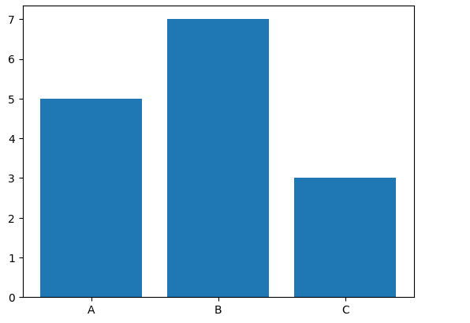
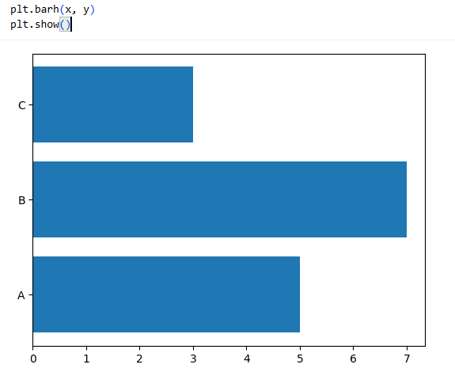
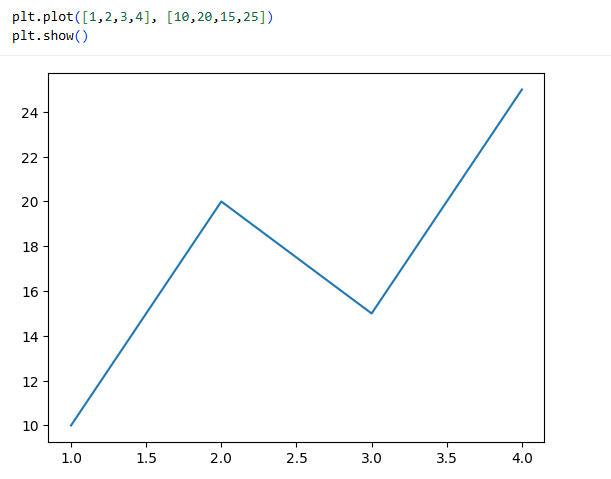
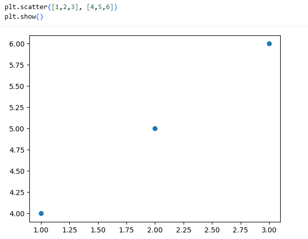
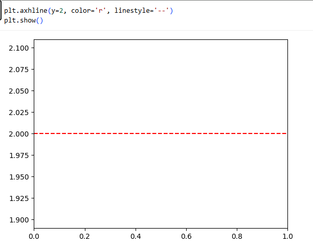
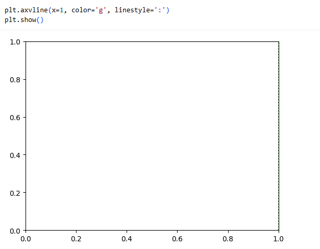
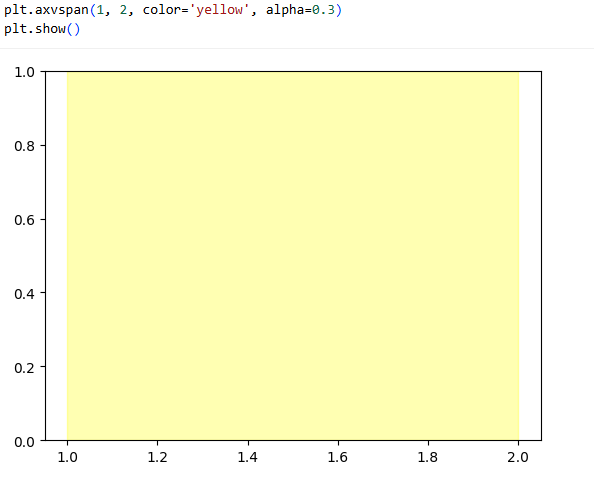

# Cheatsheet Matplotlib

## 1. Gráficos de Barras

### `bar()`
Gráfico de barras vertical.
```python
import matplotlib.pyplot as plt

x = ['A', 'B', 'C']
y = [5, 7, 3]

plt.bar(x, y)
plt.show()
````



### `barh()`

Gráfico de barras horizontal.

```python
plt.barh(x, y)
plt.show()
```



## 2. Gráficos de Línea y Dispersión

### `plot()`

Gráfico de líneas.

```python
plt.plot([1,2,3,4], [10,20,15,25])
plt.show()
```



### `scatter()`

Gráfico de dispersión.

```python
plt.scatter([1,2,3], [4,5,6])
plt.show()
```



## 3. Líneas y Áreas

### `axhline()`

Dibuja una línea horizontal.

```python
plt.axhline(y=2, color='r', linestyle='--')
plt.show()
```



### `axvline()`

Dibuja una línea vertical.

```python
plt.axvline(x=1, color='g', linestyle=':')
plt.show()
```



### `axvspan()`

Resalta un área vertical.

```python
plt.axvspan(1, 2, color='yellow', alpha=0.3)
plt.show()
```



## 4. Configuración del Eje

### `gca()`

Obtiene el eje actual.

```python
ax = plt.gca()
```

### `grid()`

Muestra la cuadrícula.

```python
plt.grid(True)
plt.show()
```


### `set_aspect()`

Controla la proporción de los ejes.

```python
ax.set_aspect('equal')
plt.show()
```

### `xlim()` y `ylim()`

Limites de los ejes.

```python
plt.xlim(0,5)
plt.ylim(0,10)
plt.show()
```

### `xticks()` y `yticks()`

Etiquetas de los ticks.

```python
plt.xticks([0,1,2,3,4,5])
plt.yticks([0,2,4,6,8,10])
plt.show()
```

## 5. Etiquetas y Texto

### `title()`

Título del gráfico.

```python
plt.title("Mi gráfico")
plt.show()
```

### `xlabel()` y `ylabel()`

Etiquetas de los ejes.

```python
plt.xlabel("Eje X")
plt.ylabel("Eje Y")
plt.show()
```

### `text()`

Añade texto en coordenadas específicas.

```python
plt.text(2, 15, "Punto máximo")
plt.show()
```

## 6. Mostrar la Figura

### `show()`

Muestra la figura generada.

```python
plt.show()
```

```