# Core Pandas Moves

Los siguientes tres métodos son **centrales en el trabajo con DataFrames** usado a lo largo de este curso:

* `df.eval()`: Realiza cálculos.  
* `df.query()`: Encuentra filas.  
* `df.groupby()`: Agrupa filas.  

Primero exploraremos cada movimiento por separado, y luego los combinaremos para tareas multietapa.

---

## DataFrame.eval()

El método `eval()` realiza cálculos.  
Es una forma eficiente de crear nuevas columnas a partir de una fórmula.

Considera esta colección de **triángulos rectángulos**:

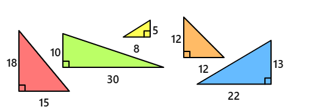

El primer triángulo tiene una base de 15 y altura de 18.  
Ejecuta el siguiente código para cargar estos datos en un DataFrame.

```python
import pandas as pd
df = pd.read_csv('right-triangles.csv')
df
````

| color  | base | height |
| ------ | :--: | :----: |
| red    |  15  |   18   |
| green  |  30  |   10   |
| yellow |   8  |    5   |
| orange |  12  |   12   |
| blue   |  22  |   13   |

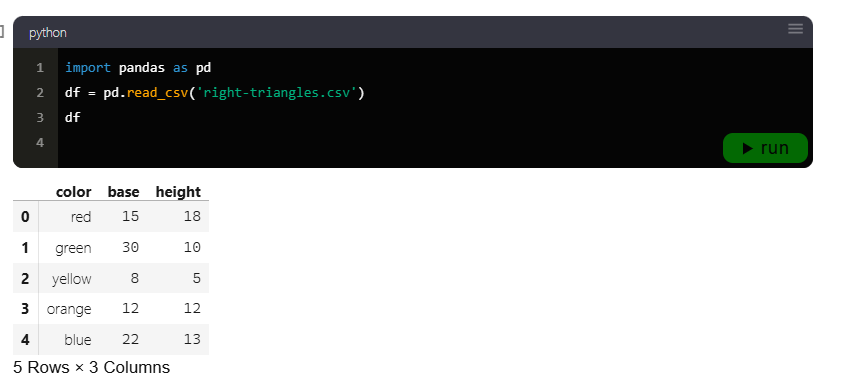

Este DataFrame tiene tres columnas: **color, base y height**.
Usemos `eval()` para calcular el **área** de cada triángulo.
Fórmula del área:

**Área = 1/2 × Base × Height**

```python
df['area'] = df.eval('0.5 * base * height')
df # mostrarlo
```

| color  | base | height | area |
| ------ | :--: | :----: | :--: |
| red    |  15  |   18   |  135 |
| green  |  30  |   10   |  150 |
| yellow |   8  |    5   |  20  |
| orange |  12  |   12   |  72  |
| blue   |  22  |   13   |  143 |

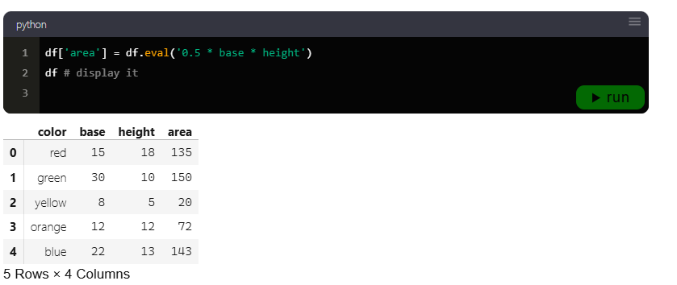

El triángulo con mayor área es **green**.

---

## DataFrame.query()

El método `query()` encuentra filas bajo una condición.
Es una forma eficiente de filtrar un DataFrame.

Carguemos un dataset de ejemplo:

```python
months = pd.read_csv('days-per-month.csv')
months
```

| month     | days | leap\_days |
| --------- | :--: | :--------: |
| January   |  31  |      0     |
| February  |  28  |      1     |
| March     |  31  |      0     |
| April     |  30  |      0     |
| May       |  31  |      0     |
| ...       |  ... |     ...    |
| August    |  31  |      0     |
| September |  30  |      0     |
| October   |  31  |      0     |
| November  |  30  |      0     |
| December  |  31  |      0     |

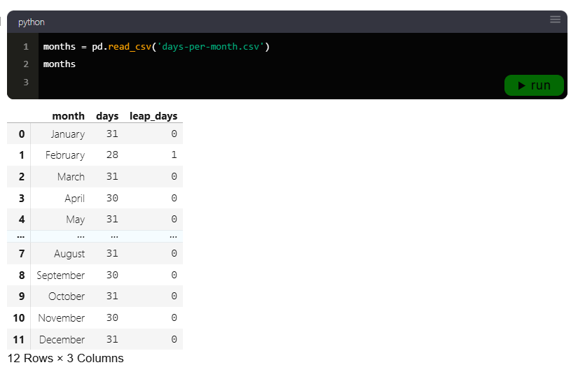

**Objetivo de la actividad:** Listar los meses con más de 30 días.

```python
months.query('days > 30')
```

| month    | days | leap\_days |
| -------- | :--: | :--------: |
| January  |  31  |      0     |
| March    |  31  |      0     |
| May      |  31  |      0     |
| July     |  31  |      0     |
| August   |  31  |      0     |
| October  |  31  |      0     |
| December |  31  |      0     |

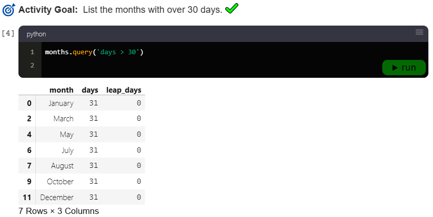

**Objetivo de la actividad:** Mostrar el mes con menos días.

```python
months.query('days == days.min()')
```

| month    | days | leap\_days |
| -------- | :--: | :--------: |
| February |  28  |      1     |

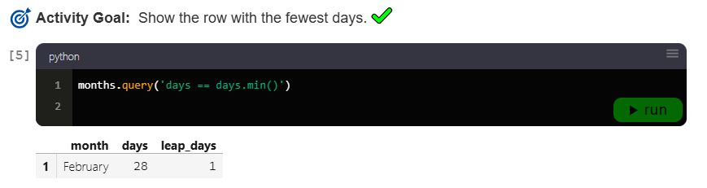

---

## DataFrame.groupby()

El método `groupby()` agrupa filas que comparten un valor común.
Luego podemos realizar cálculos de agregación: `min()`, `max()`, `mean()`, `sum()`.

Consideremos este dataset de frutas:

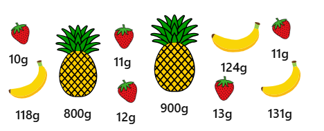

```python
df = pd.read_csv('fruit-weights.csv')
df
```

| fruit      | weight |
| ---------- | :----: |
| strawberry |   10   |
| banana     |   118  |
| pineapple  |   800  |
| strawberry |   11   |
| strawberry |   12   |
| pineapple  |   900  |
| banana     |   124  |
| strawberry |   13   |
| strawberry |   11   |
| banana     |   131  |

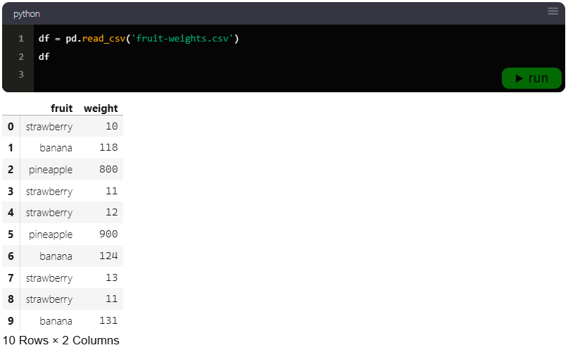

**Objetivos de la actividad:**

* Agrupar filas por tipo de fruta.
* Usar la variable `groups`.
* Mostrar los grupos.

```python
groups = df.groupby('fruit')
groups # mostrar
```

| fruit      |   weight  |
| ---------- | :-------: |
| banana     | ...3 rows |
| pineapple  | ...2 rows |
| strawberry | ...5 rows |

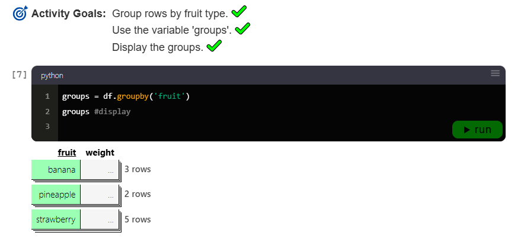

**Objetivo:** Calcular el promedio de peso por grupo.

```python
groups['weight'].mean()
```

| fruit      | mean\_weight |
| ---------- | :----------: |
| banana     |    124.333   |
| pineapple  |      850     |
| strawberry |     11.4     |

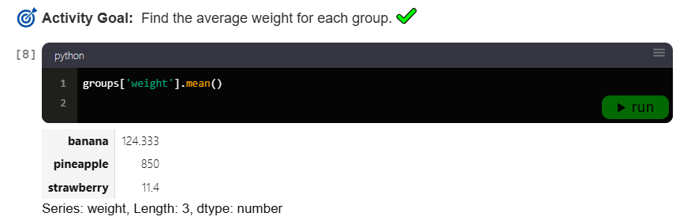

Convertimos el índice en columna para obtener un DataFrame:

```python
groups = df.groupby('fruit')
series = groups['weight'].mean()
series.reset_index()
```

| fruit      |  weight |
| ---------- | :-----: |
| banana     | 124.333 |
| pineapple  |   850   |
| strawberry |   11.4  |

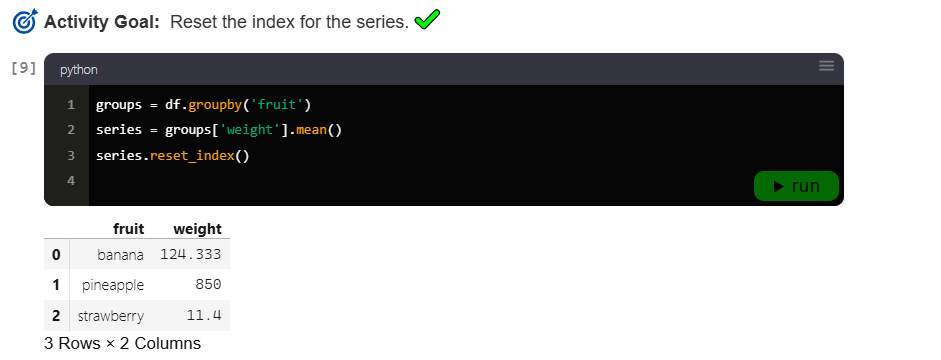

También podemos realizar todo en **una sola línea de código**:

```python
df.groupby('fruit')['weight'].mean().reset_index()
```

| fruit      |  weight |
| ---------- | :-----: |
| banana     | 124.333 |
| pineapple  |   850   |
| strawberry |   11.4  |

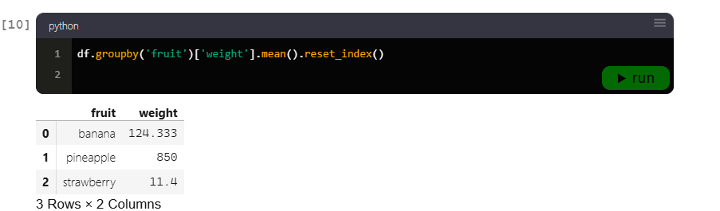

````

---
