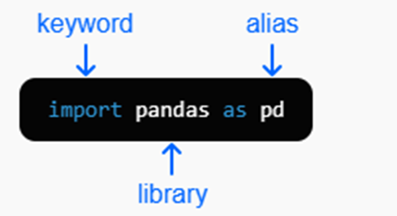

# Hoja de referencia de sintaxis de Python

---

## Importando bibliotecas

Importamos bibliotecas para añadir funcionalidad a Python.

```python
import pandas as pd
````

* **keyword** → `import`
* **library** → `pandas`
* **alias** → `pd`

**Ejemplos:**

```python
# Importar pandas con alias
import pandas as pd

# Importar matplotlib con alias
import matplotlib.pyplot as plt

# Importar sin alias
import math
math.sqrt(144)  # 12
```

---

## Fundamentos de Python

| Concepto           | Sintaxis                   |
| ------------------ | -------------------------- |
| Variable           | `nombre = valor`           |
| Método             | `obj.hacer_algo()`         |
| Argumentos         | `obj.metodo(arg1, arg2)`   |
| Argumento nombrado | `obj.metodo(nombre=valor)` |
| Comentario         | `# esto es un comentario`  |
| Imprimir salida    | `print('texto')`           |

---

## Tipos de datos

| Concepto        | Sintaxis                 |
| --------------- | ------------------------ |
| Entero          | `42`                     |
| Entero negativo | `-42`                    |
| Flotante        | `3.14`                   |
| Cadena (string) | `'hola'`                 |
| Cadena (string) | `"¡Es texto!"`           |
| Booleano        | `True` / `False`         |
| Lista           | `[0, 1, 2]`              |
| Diccionario     | `{'e':2.718, 'pi':3.14}` |
| Sin valor       | `None`                   |

---

## Comparaciones

| Concepto        | Sintaxis      |
| --------------- | ------------- |
| ¿Es igual?      | `valor == 42` |
| ¿No es igual?   | `valor != 42` |
| ¿Mayor que?     | `valor > 42`  |
| ¿Mayor o igual? | `valor >= 42` |
| ¿Menor que?     | `valor < 42`  |
| ¿Menor o igual? | `valor <= 42` |

---

## Objetos

| Concepto           | Sintaxis              |
| ------------------ | --------------------- |
| Crear nuevo objeto | `obj = AlgunaClase()` |
| Primer elemento    | `obj[0]`              |
| Segundo elemento   | `obj[1]`              |
| Elemento nombrado  | `obj['nombre']`       |
| Propiedad          | `obj.propiedad`       |
| Llamar método      | `obj.metodo()`        |

---

## Bibliotecas

| Concepto   | Sintaxis                          |
| ---------- | --------------------------------- |
| Importar   | `import biblioteca`               |
| Como alias | `import biblioteca as lib`        |
| Pandas     | `import pandas as pd`             |
| Matplotlib | `import matplotlib.pyplot as plt` |
