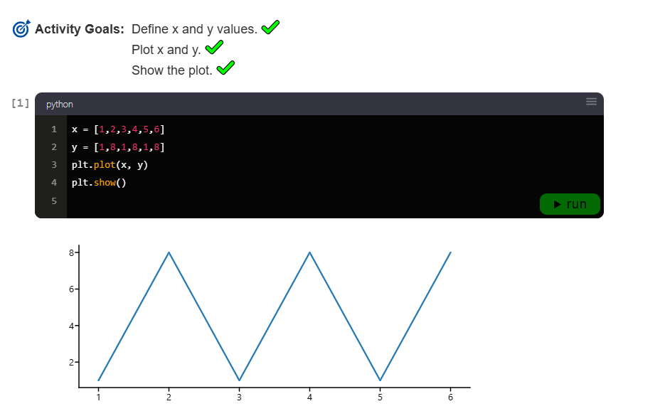
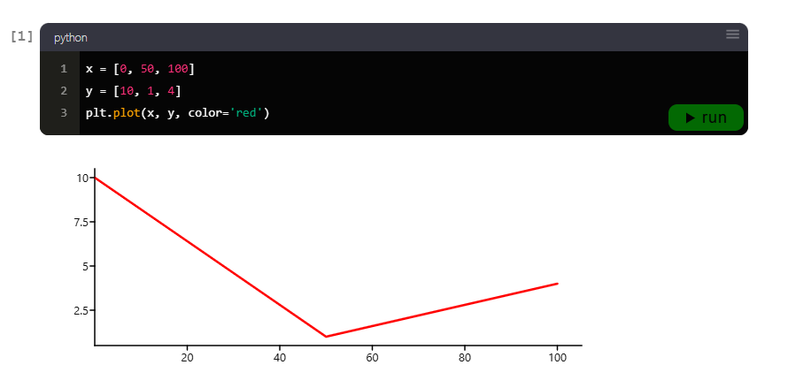
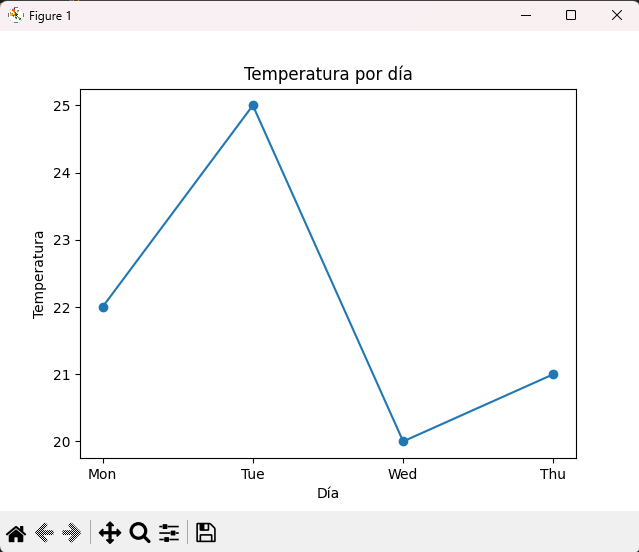
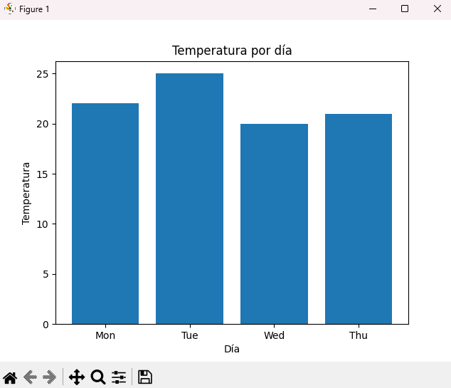
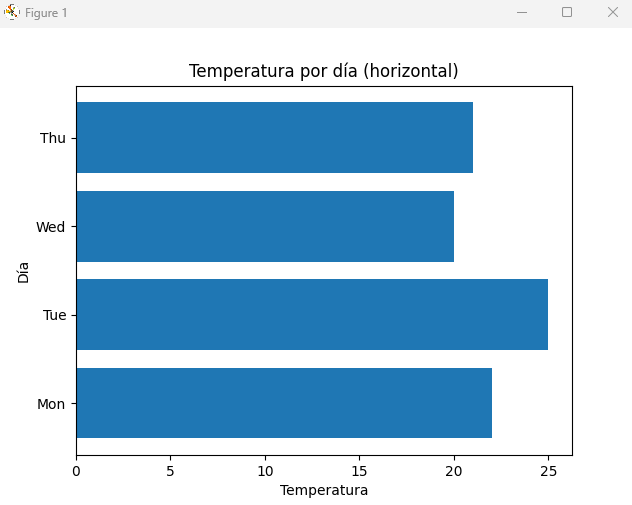
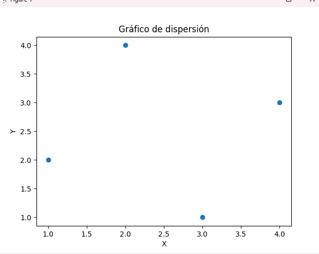
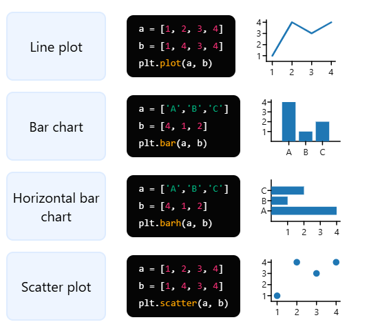
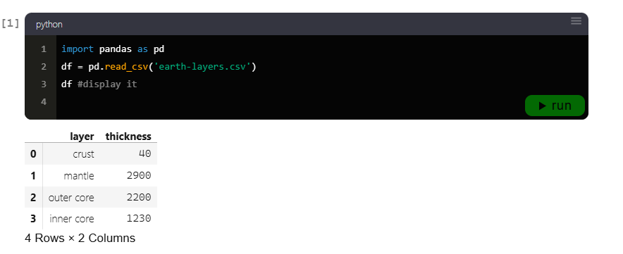
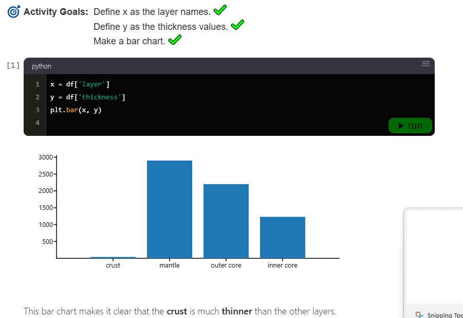
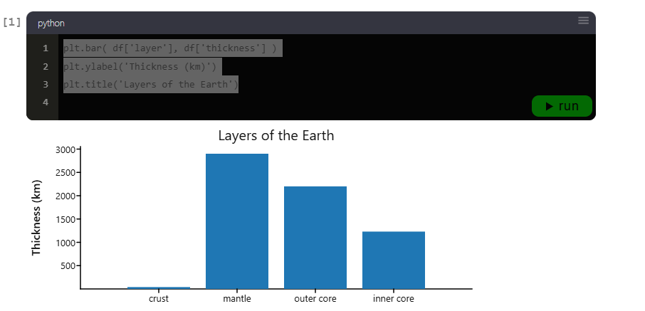

# Matplotlib Pyplot

Matplotlib.pyplot es la biblioteca principal de **Python para la visualización de datos**.  
¿Listo para convertir datos en gráficos y diagramas? ¡Vamos a sumergirnos y empezar a graficar!

---

## Importando Matplotlib

El módulo `pyplot` de Matplotlib se importa típicamente con el alias **plt**.  
Importemos pyplot y veamos lo que puede hacer.

**Objetivos de la actividad:**
* Importar matplotlib.  
* Usar `plt` como alias.  

```python
import matplotlib.pyplot as plt
````


Con Matplotlib importado, desbloqueamos un poderoso conjunto de herramientas de graficación.

---

## Primer gráfico

La mayoría de los métodos de graficación toman valores de `x` e `y` como sus dos primeros argumentos.
Para ilustrar, tracemos un simple patrón de zig-zag:

**Objetivos de la actividad:**

1. Definir valores `x` e `y`.
2. Graficar `x` e `y`.
3. Mostrar la gráfica.

```python
x = [1,2,3,4,5,6]
y = [1,8,1,8,1,8]
plt.plot(x, y)
plt.show()
```



¡Nuestra primera gráfica!

---

## Mostrar o no mostrar

En el ejemplo anterior usamos `plt.show()` para mostrar la gráfica.
Sin embargo, en muchos cuadernos interactivos se ejecuta automáticamente.

**Ejemplo sin `plt.show()`:**

```python
x = [0, 50, 100]
y = [10, 1, 4]
plt.plot(x, y, color='red')
```



---

## Las cuatro gráficas básicas

En este curso, nos enfocaremos en los **4 métodos más básicos** de graficación:

* **Gráfico de líneas**
* **Gráfico de barras**
* **Gráfico de barras horizontal**
* **Gráfico de dispersión**
---

### 1️⃣ **Gráfico de líneas (`line plot`)**

* **Uso principal:** Mostrar **tendencias a lo largo del tiempo** o secuencias continuas.
* **Ejemplo típico:** Evolución de la temperatura diaria, ventas por mes, precios de acciones.
* **Ventaja:** Muy útil para detectar patrones, aumentos o disminuciones, y comparaciones de series temporales.

```python
import matplotlib.pyplot as plt
import pandas as pd

df = pd.DataFrame({'day':['Mon','Tue','Wed','Thu'], 'temp':[22,25,20,21]})
plt.plot(df['day'], df['temp'], marker='o')
plt.title("Temperatura por día")
plt.xlabel("Día")
plt.ylabel("Temperatura")
plt.show()
```

---

### 2️⃣ **Gráfico de barras (`bar plot`)**

* **Uso principal:** Comparar **categorías discretas** entre sí.
* **Ejemplo típico:** Número de estudiantes por grado, ventas por producto, ingresos por región.
* **Ventaja:** Muy visual para ver cuál categoría tiene mayor o menor valor.

```python
plt.bar(df['day'], df['temp'])
plt.title("Temperatura por día")
plt.xlabel("Día")
plt.ylabel("Temperatura")
plt.show()
```

---

### 3️⃣ **Gráfico de barras horizontal (`barh`)**

* **Uso principal:** Igual que el de barras vertical, pero **más cómodo cuando las etiquetas son largas** o hay muchas categorías.
* **Ejemplo típico:** Encuestas, ranking de productos, comparaciones de nombres largos.
* **Ventaja:** Las etiquetas horizontales son más fáciles de leer.

```python
plt.barh(df['day'], df['temp'])
plt.title("Temperatura por día (horizontal)")
plt.xlabel("Temperatura")
plt.ylabel("Día")
plt.show()
```

---

### 4️⃣ **Gráfico de dispersión (`scatter plot`)**

* **Uso principal:** Mostrar la **relación entre dos variables numéricas**.
* **Ejemplo típico:** Relación entre altura y peso, velocidad y tiempo, inversión y retorno.
* **Ventaja:** Permite ver correlaciones, patrones, concentraciones y posibles valores atípicos.

```python
df2 = pd.DataFrame({'x':[1,2,3,4], 'y':[2,4,1,3]})
plt.scatter(df2['x'], df2['y'])
plt.title("Gráfico de dispersión")
plt.xlabel("X")
plt.ylabel("Y")
plt.show()
```

---

💡 **Resumen práctico:**

| Gráfica                   | Uso principal                                      |
| ------------------------- | -------------------------------------------------- |
| Línea (`line`)            | Tendencias, series temporales                      |
| Barra (`bar`)             | Comparar categorías discretas                      |
| Barra horizontal (`barh`) | Comparar categorías con etiquetas largas           |
| Dispersión (`scatter`)    | Relación/correlación entre dos variables numéricas |

---



Estos versátiles tipos de gráficos forman la base para una amplia gama de visualizaciones de datos.

---

## Graficando DataFrames

Matplotlib se integra perfectamente con **Pandas**, lo que facilita convertir **DataFrames** en visualizaciones.

**Objetivos de la actividad:**

1. Importar pandas.
2. Cargar `earth-layers.csv` en la variable `df`.
3. Mostrar el dataframe.

```python
import pandas as pd
df = pd.read_csv('earth-layers.csv')
df # mostrarlo
```

| layer      | thickness |
| ---------- | --------- |
| crust      | 40        |
| mantle     | 2900      |
| outer core | 2200      |
| inner core | 1230      |



Ahora tracemos el grosor de cada capa en un gráfico de barras.

```python
x = df['layer']
y = df['thickness']
plt.bar(x, y)
```



---

## Etiquetas y títulos

Matplotlib también permite agregar **etiquetas y títulos** a las gráficas.

**Objetivos de la actividad:**

* Agregar una etiqueta al eje `y`.
* Agregar un título.

```python
plt.bar(df['layer'], df['thickness'])
plt.ylabel('Thickness (km)')
plt.title('Layers of the Earth')
```



Observa cómo pudimos pasar directamente las columnas del DataFrame al método `bar()`.

---

## Conclusión

Esta fue una introducción rápida a lo básico de **Matplotlib**.

**Lo que cubrimos:**

* `bar( )`
* `barh( )`
* `plot( )`
* `scatter( )`
* `title( )`
* `xlabel( )`
* `ylabel( )`

Exploraremos técnicas más avanzadas de visualización a lo largo del curso.
Estas técnicas se benefician de los movimientos básicos de **pandas**, que cubriremos a continuación.


```

---

¿Quieres que te prepare también una **versión con índice automático de contenidos** al inicio del archivo para que sea más navegable en GitHub?
```
