# 1.2 Conoce el **DataFrame**

Aprendimos cómo usar bibliotecas de Python lanzando un cohete. 🚀  
Aquí exploraremos la popular biblioteca de ciencia de datos conocida como **Pandas**.

---

## La biblioteca Pandas


La biblioteca Pandas contiene varios objetos de Python. Aquí tienes descripciones breves de los objetos que usaremos:

* **DataFrame:** Una estructura de datos 2D con filas y columnas.
* **Series:** Una estructura de datos 1D.
* **read_csv( ):** Una función para cargar archivos CSV como DataFrames.
* **y más…** Hay muchas más funcionalidades en la biblioteca Pandas.

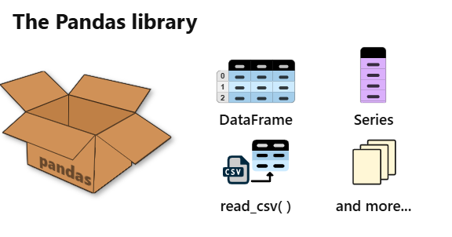

La clase **DataFrame** es la estrella principal. Es la estructura de datos más común en el mundo de la ciencia de datos con Python. Vamos a crear un DataFrame y ver cómo funciona.

---

## Construir un DataFrame

Apliquemos lo aprendido para **importar** la biblioteca Pandas e instanciar un DataFrame.  
El alias estándar para Pandas es **pd**.

### Objetivos de la actividad:

* Importar pandas.
* Crear un DataFrame.

```python
import pandas as pd
pd.DataFrame()
````
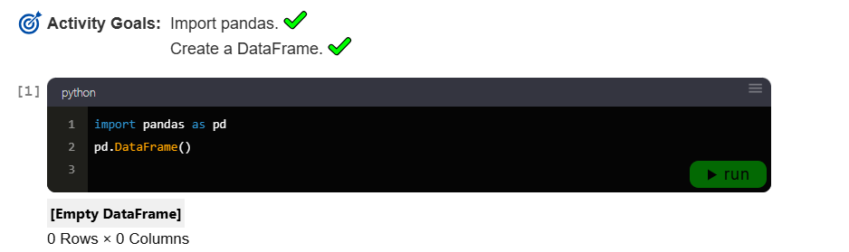
```
[Empty DataFrame]
0 Rows × 0 Columns
```

¡Tenemos nuestro primer DataFrame!
Pero está vacío, lo cual es algo aburrido. Afortunadamente, Pandas nos permite llenarlo con datos.

Por ejemplo, consideremos los siguientes círculos como fuente de datos:

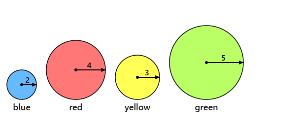

```
2  blue
4  red
3  yellow
5  green
```

Estos círculos tienen radios: 2, 4, 3 y 5.
Vamos a poner estos datos en un DataFrame asignando columnas **color** y **radius**.

### Objetivos de la actividad:

* Asignar una columna *color*.
* Asignar una columna *radius*.
* Mostrar el resultado.

```python
df = pd.DataFrame()
df['color'] = ['blue','red','yellow','green']
df['radius'] = [2,4,3,5]
df  # mostrar resultado
```

|   | color  | radius |
| - | ------ | ------ |
| 0 | blue   | 2      |
| 1 | red    | 4      |
| 2 | yellow | 3      |
| 3 | green  | 5      |

**4 filas × 2 columnas**
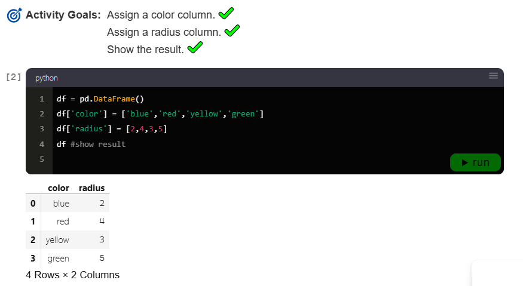
---

## Cálculos con columnas

También podemos calcular nuevas columnas.
Por ejemplo, vamos a calcular la columna **diameter** multiplicando el radio por 2.

### Objetivos de la actividad:

* Calcular una columna *diameter*.
* Mostrar el resultado.

```python
df['diameter'] = df['radius'] * 2
df  # mostrar resultado
```

|   | color  | radius | diameter |
| - | ------ | ------ | -------- |
| 0 | blue   | 2      | 4        |
| 1 | red    | 4      | 8        |
| 2 | yellow | 3      | 6        |
| 3 | green  | 5      | 10       |

**4 filas × 3 columnas**


Ejemplos de cálculos rápidos:

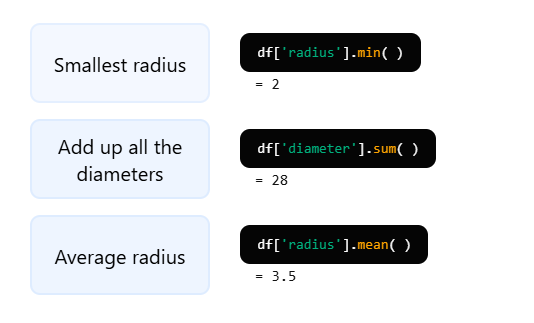
```python
df['radius'].min()   # = 2
df['diameter'].sum() # = 28
df['radius'].mean()  # = 3.5
```

---

## Columnas como Series

Para referenciar columnas de un DataFrame usamos corchetes:

```python
df['nombre_columna']
```

Esto devuelve la columna como un objeto **Series**.

Ejemplo:

```python
df['color']
```

```
0     blue
1      red
2   yellow
3    green
Name: color, dtype: string
```
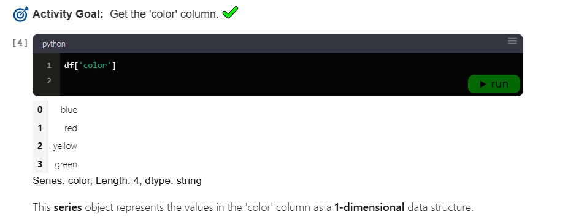
---

## Filas como Series

También podemos acceder a filas como Series usando el accesor **iloc\[ ]**:

```python
df.iloc[entero]
```

* Primera fila: `df.iloc[0]`
* Segunda fila: `df.iloc[1]`
* Última fila: `df.iloc[-1]` (números negativos cuentan hacia atrás)

---
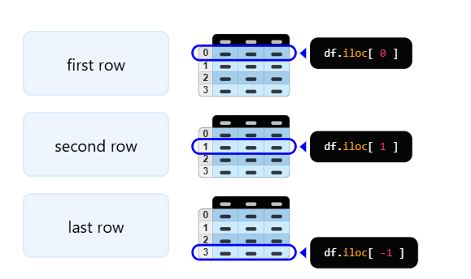
## Otras partes de un DataFrame

Además de filas y columnas, aquí hay otros elementos importantes:

```python
df.index    # etiquetas de fila
df.columns  # nombres de columnas
df.shape    # tamaño (filas, columnas)
```
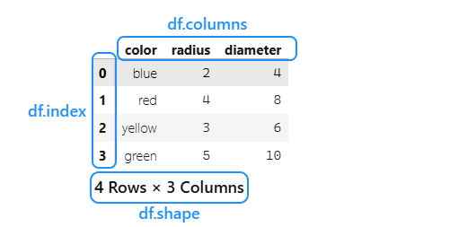

Ejemplo con los círculos:

```python
df.shape
# (4, 3)

df.shape[0]  # número de filas = 4
df.shape[1]  # número de columnas = 3
```
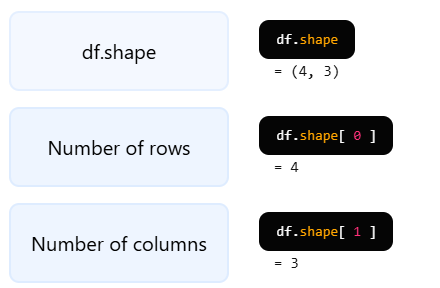
---

## Cargar datos desde archivos

La biblioteca Pandas puede leer varios formatos de datos, incluyendo **CSV, XML, JSON y Excel**.

El formato **CSV** (valores separados por comas) es comúnmente usado para compartir datasets.  
También es práctica habitual incluir un archivo *README* con descripciones útiles de los datos.

---

#### Ejemplo: earth-layers.csv

Contenido del archivo `earth-layers.csv`:

```

layer,thickness
crust,40
mantle,2900
outer core,2200
inner core,1230

```

Contenido del archivo `README.md`:
Archivo Readme

Mini dataset de las principales capas de la Tierra.

Columnas:

layer: Nombre de la capa.

thickness: Grosor promedio de la capa medido en kilómetros.

Estructura interna de la Tierra:

Corteza (Crust)

Manto (Mantle)

Núcleo interno (Inner Core)

Núcleo externo (Outer Core)

Este dataset trata sobre las capas de la Tierra.
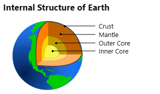
```

Este dataset trata sobre las capas de la Tierra.
Según el readme, el grosor (thickness) está medido en kilómetros.

````

---

#### Leer CSV con Pandas

Usaremos la función `read_csv()` de Pandas para cargar `earth-layers.csv` en un DataFrame.  
En lugar de llamarlo `df`, usaremos un nombre más descriptivo: **layers**.

###### Objetivos de la actividad:

* Leer `earth-layers.csv` en un DataFrame.
* Llamarlo `layers`.
* Mostrar el DataFrame.

```python
import pandas as pd

layers = pd.read_csv('earth-layers.csv')
layers  ## mostrarlo
````

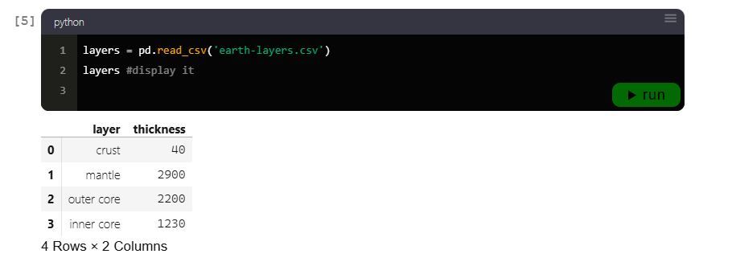


La forma de este DataFrame tiene 4 filas, representando las 4 capas principales de la Tierra.
Vemos que la capa más delgada es la **crust** (corteza).

---

#### Calcular el grosor total de todas las capas

Podemos usar el método `sum()` para calcular el grosor total de todas las capas, obteniendo una estimación del radio de la Tierra.

###### Objetivo de la actividad:

* Sumar todos los valores de la columna `thickness`.

```python
layers['thickness'].sum()
## 6370
```

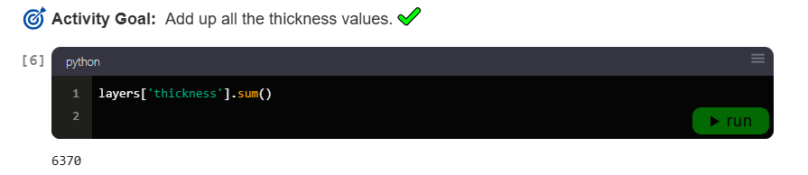

Las cuatro capas suman **6370 kilómetros**, una buena aproximación del radio de la Tierra.

---

#### Reflexión

Esto apenas rasca la superficie (¿o la corteza?) de lo que es posible con la biblioteca Pandas.
A partir de aquí, podemos explorar más cálculos, filtrado de filas, agregaciones y visualización de datos.
```

