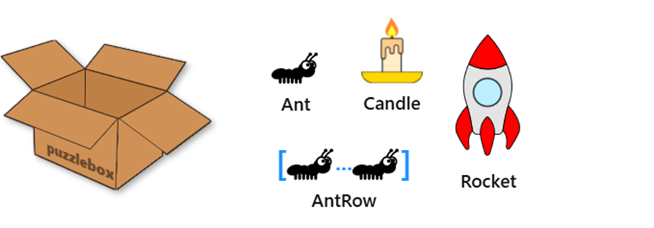
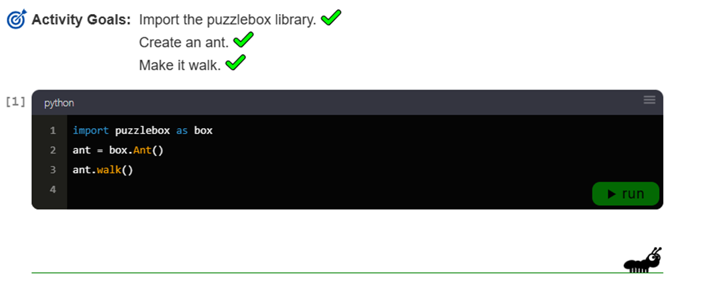
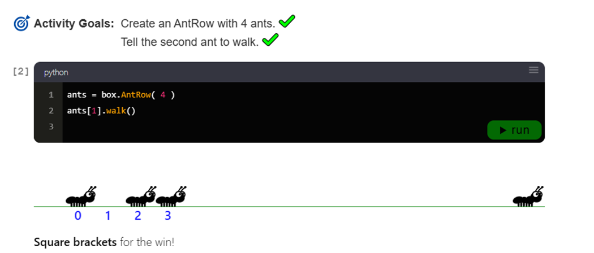
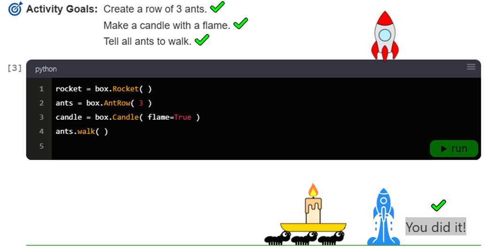
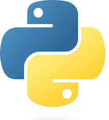

# 1.1 Python desde cero en 60 segundos

¿Listo para programar en Python? Abróchate el cinturón, porque esta es una introducción rapidísima a la programación en Python.

---

## Bibliotecas de Python

El poder de Python proviene de la gran cantidad de **bibliotecas de código** disponibles.  
Una biblioteca es un paquete de objetos de código reutilizables que puedes importar y combinar con otro código para hacer que sucedan cosas increíbles.

Este curso cubrirá dos bibliotecas populares de ciencia de datos: **Pandas** y **Matplotlib**.  
Pero para introducir algunos conceptos, primero jugaremos con la biblioteca `puzzlebox`, que hicimos solo por diversión.

Haz clic en la puzzlebox de abajo para ver los objetos de código que contiene:



Este paquete tiene cuatro clases de objetos dentro: **Hormiga, Vela, FilaDeHormigas y Cohete**.  
Importemos esta biblioteca en Python y veamos lo que puede hacer.

---

## Importando bibliotecas

En Python usamos la palabra clave `import` para hacer que una biblioteca esté disponible para programar.  
Incluso si nunca has programado en Python antes, intenta importar la biblioteca `puzzlebox` y hacer que una hormiga camine por la pantalla.

**Objetivos de la actividad:**
- Importar la biblioteca `puzzlebox`.
- Crear una hormiga.
- Hacer que camine.

```python
import puzzlebox as box

ant = box.Ant()
ant.walk()
````

¡Funcionó!
¿Qué más podemos hacer con esta `puzzlebox`?

---



## Elementos indexados

Algunos objetos tienen subelementos a los que podemos acceder por índice usando **corchetes**:

```python
subitem = objeto[indice]
```

La numeración de índices comienza en **cero** en Python.
El índice `0` es el primero, el `1` es el segundo, y así sucesivamente...

Para ver cómo funciona esto, crea un `AntRow` y haz que la **segunda hormiga** camine con `.walk()`.

**Objetivos de la actividad:**

* Crear un `AntRow` con 4 hormigas.
* Hacer que la segunda hormiga camine.

```python
ants = box.AntRow(4)
ants[1].walk()
```

¡Corchetes al poder!
Ten en cuenta que `ants[0]` es la primera, y `ants[1]` es la segunda.

---

## Lanzar un cohete

Para el gran final, vamos a coordinar múltiples objetos para **lanzar un cohete**.

**Objetivos de la actividad:**

* Crear una fila de 3 hormigas.
* Hacer una vela con llama.
* Hacer que todas las hormigas caminen.

```python
rocket = box.Rocket()
ants = box.AntRow(3)
candle = box.Candle(flame=True)

ants.walk()
```

¡Despegue! 🚀

---

## Resumen

Esa fue una introducción rapidísima a Python. Esto es lo que aprendimos:

* **Importar bibliotecas:** `import puzzlebox as box`
* **Crear objetos:** `ant = box.Ant()`
* **Llamar métodos:** `ant.walk()`
* **Argumentos de funciones:** `AntRow(3)`
* **Argumentos con palabras clave:** `Candle(flame=True)`
* **Indexación comenzando en cero:** `ants[0]`, `ants[1]`, `ants[2]`

**Documentación:**

* Importar bibliotecas
* Sintaxis de Python

A continuación, aplicaremos estos conceptos a la ciencia de datos con una biblioteca llamada **Pandas**.

---


