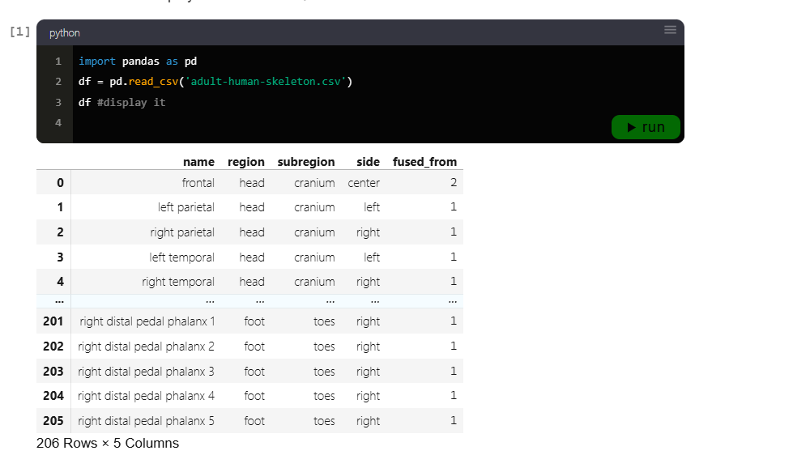
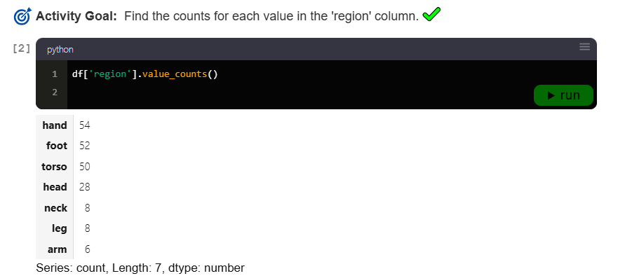
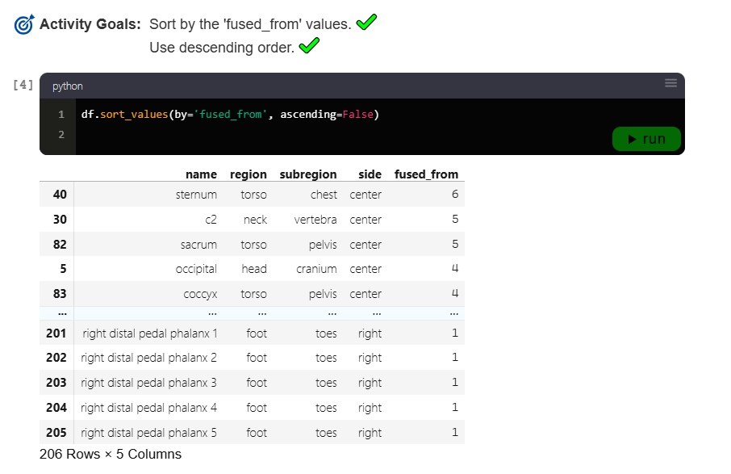

# Variación Esquelética

La comparación de esqueletos entre especies condujo a ideas históricas en la biología evolutiva. En este proyecto, explorarás los huesos del cuerpo humano y harás comparaciones con una amplia variedad de mamíferos y aves.

---

## Cargando los datos
El archivo **'adult-human-skeleton.csv'** contiene información sobre cada hueso del cuerpo humano.  
Carga el archivo csv y échale un vistazo.

### Objetivos de la actividad:
- Importar pandas.  
- Cargar los datos del esqueleto.  
- Mostrar el dataframe.  

```python
import pandas as pd
df = pd.read_csv('adult-human-skeleton.csv')
df #display it
````



---

Cada fila representa un hueso en el cuerpo humano adulto. Podemos ver que los adultos tienen **206 huesos**.
¿Qué más podemos descubrir?

---

## Afirmación: 50% de los huesos están en manos y pies

Probablemente hayas escuchado la afirmación de que más de la mitad de los huesos en tu cuerpo se encuentran en tus manos y pies. ¿Es cierta esta afirmación o es una leyenda urbana?

Contemos los huesos en cada región usando el método `value_counts()`.

### Objetivo de la actividad:

* Encontrar los conteos para cada valor en la columna 'region'.

```python
df['region'].value_counts()
```

```
hand    54
foot    52
torso   50
head    28
neck     8
leg      8
arm      6
```



Las manos tienen un total de **54 huesos**, y los pies tienen **52 huesos**.
Antes vimos que el cuerpo entero tiene **206 huesos**. Usando Python, podemos calcular qué proporción están en manos y pies:

```python
(54 + 52) / 206
```

```
0.5145631067961165
```

Más del **51% de los huesos** se encuentran en manos y pies. ¡La afirmación es cierta!

---

## Huesos de bebés

Los infantes tienen más huesos que los adultos, pero a medida que el bebé se desarrolla, grupos de huesos se fusionan. Esto está detallado en la columna **'fused\_from'** de nuestros datos.

Ordenemos con `sort_values()` usando la columna **fused\_from**.

### Objetivos de la actividad:

* Ordenar por valores en 'fused\_from'.
* Usar orden descendente.

```python
df.sort_values(by='fused_from', ascending=False)

```

| name      | region | subregion | side   | fused\_from |
| --------- | ------ | --------- | ------ | ----------- |
| sternum   | torso  | chest     | center | 6           |
| c2        | neck   | vertebra  | center | 5           |
| sacrum    | torso  | pelvis    | center | 5           |
| occipital | head   | cranium   | center | 4           |
| coccyx    | torso  | pelvis    | center | 4           |
| …         | …      | …         | …      | …           |


Esto muestra una gran variedad de fusiones de huesos en el cuerpo.
Por ejemplo, el esternón se forma de la fusión de **6 huesos**.

Antes de que ocurra toda esta fusión, ¿cuántos huesos tienen los bebés?
Podemos responder calculando la suma de todos los valores en **fused\_from**.

```python
df['fused_from'].sum()
```

```
305
```

Los bebés humanos tienen **305 huesos**, muchos de los cuales se fusionan, resultando en 206 huesos en el adulto.


---

## Huesos del cuello humano

Los cuellos son bastante flexibles. ¿Cuántos huesos hay en el cuello humano para permitir esa flexibilidad?

Usemos el método `query()` para averiguarlo.

### Objetivo de la actividad:

* Encontrar todas las filas donde la región es 'neck'.

```python
df.query('region == "neck"')
```

| name  | region | subregion | side   | fused\_from |
| ----- | ------ | --------- | ------ | ----------- |
| hyoid | neck   | throat    | center | 3           |
| c1    | neck   | vertebra  | center | 3           |
| c2    | neck   | vertebra  | center | 5           |
| c3    | neck   | vertebra  | center | 3           |
| c4    | neck   | vertebra  | center | 3           |
| c5    | neck   | vertebra  | center | 3           |
| c6    | neck   | vertebra  | center | 3           |
| c7    | neck   | vertebra  | center | 3           |

El cuello tiene **1 hueso en la garganta** y una pila de **7 vértebras cervicales**, nombradas C1 a C7.
La "C" significa **cervical**, es decir, cuello.


Entonces, los humanos tenemos siete vértebras cervicales. ¿Y los demás mamíferos?
---

## Huesos del cuello de mamíferos

Este proyecto incluye el archivo **'mammal-neck-bones.csv'**.
Carguémoslo para explorar los cuellos de otros mamíferos.

### Objetivos de la actividad:

* Cargar los datos de mamíferos.
* Mostrarlos.

```python
mammals = pd.read_csv('mammal-neck-bones.csv')
mammals #display it
```

| species       | neck\_vertebrae |
| ------------- | --------------- |
| cheetah       | 7               |
| impala        | 7               |
| giant panda   | 7               |
| hartebeest    | 7               |
| moose         | 7               |
| …             | …               |
| alpaca        | 7               |
| common wombat | 7               |
| red fox       | 7               |
| fennec fox    | 7               |
| sea lion      | 7               |

**302 Filas × 2 Columnas**


La mayoría muestra tener **7 vértebras cervicales**, pero ¿es esto cierto para todos?

### ¿Qué pasa con la jirafa?

```python
mammals.query('species == "giraffe"')
```

| species | neck\_vertebrae |
| ------- | --------------- |
| giraffe | 7               |

¡A pesar de su largo cuello, las jirafas también tienen **7 vértebras cervicales**!

---

### ¿Todos los mamíferos tienen 7 vértebras?
Entonces, ¿todos los mamíferos tienen 7 vértebras? Podemos usar otra consulta para buscar cualquier fila donde la columna cervical no sea 7.
```python
mammals.query('neck_vertebrae != 7')
```

| species                   | neck\_vertebrae |
| ------------------------- | --------------- |
| pale-throated sloth       | 9               |
| brown-throated sloth      | 9               |
| hoffmann's two-toed sloth | 6               |
| west indian manatee       | 6               |

¡Ajá! Parece que los únicos mamíferos sin 7 vértebras son **perezosos** y **manatíes**.


---

## Huesos del cuello de aves

Mientras que los mamíferos casi siempre tienen 7 vértebras cervicales, ¿qué ocurre con las aves?
Carguemos el archivo **'bird-neck-bones.csv'**.

### Objetivos de la actividad:

* Cargar los datos de aves.
* Mostrarlos.

```python
birds = pd.read_csv('bird-neck-bones.csv')
birds #display it
```

| species              | neck\_vertebrae |
| -------------------- | --------------- |
| cinereous vulture    | 13              |
| guineafowl           | 14              |
| red-legged partridge | 14              |
| blue-cheeked parrot  | 12              |
| northern pintail     | 15              |
| …                    | …               |
| barn owl             | 12              |
| eurasian hoopoe      | 13              |
| murre                | 13              |
| nz rockwren          | 13              |
| bushwren             | 13              |

**81 Filas × 2 Columnas**

Las aves parecen tener **muchas más vértebras cervicales que los mamíferos**.

### Distribución

Hagamos un gráfico de barras con los conteos:

```python
bird_counts = birds['neck_vertebrae'].value_counts()
bird_counts = bird_counts.sort_index()
bird_counts.plot.bar()
```


La mayoría de las aves tienen **13 vértebras cervicales**, pero el máximo es **23**.

---

### ¿Qué ave tiene el máximo?

```python
birds.query('neck_vertebrae == neck_vertebrae.max()')
```

| species   | neck\_vertebrae |
| --------- | --------------- |
| mute swan | 23              |

¡El hermoso 🦢 **cisne mudo** 🦢 se lleva el premio!


---